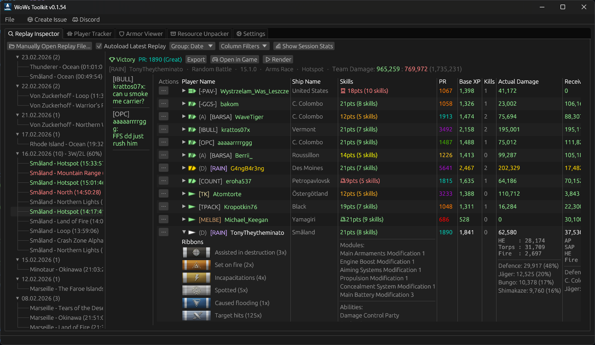
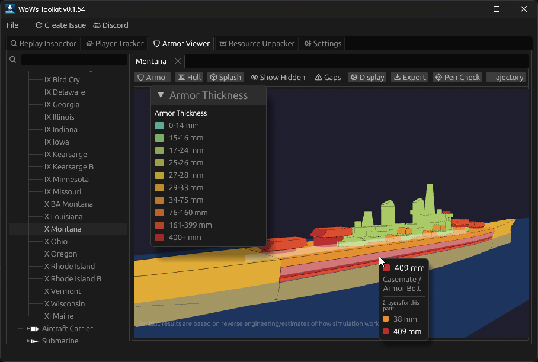

# WoWs Toolkit / 战舰世界工具集

战舰世界游戏数据、replay 与资源解析的单仓工具集。
A monorepo of tools for interacting with World of Warships game data, replays, and assets.

> 本分支（`codex/local-changes`）在 upstream 基础上增加了操作剧本经验分析模块。
> 上游：https://github.com/landaire/wows-toolkit

---

## 操作剧本经验分析（本分支）

利用 2060 局 replay 数据，对 WG 经验分配公式进行逆向拟合。以下按文档组织，每篇文档列出关联脚本。

### 核心文档

**[docs/Q6_CLASS_K_ANALYSIS.md](docs/Q6_CLASS_K_ANALYSIS.md)** — 舰种系数 K 的分解：伤害类型、集中度、增援
> `scripts/analyze_damage_types.py` · `scripts/concentration_run.py` · `scripts/analyze_reinforcement7.py` · `scripts/fit_class_efficiency.py` · `scripts/analyze_ops_efficiency.py`

**[docs/reinforcement-damage-analysis.md](docs/reinforcement-damage-analysis.md)** — 增援伤害与经验回报验证（修正版）
> `scripts/analyze_reinforcement.py` ~ `scripts/analyze_reinforcement7.py`

**[docs/WOWS_OPERATIONS_ANALYSIS.md](docs/WOWS_OPERATIONS_ANALYSIS.md)** — 样本分析：船均经验预测玩家表现
> `scripts/analyze_ops_samples.py`

**[docs/PROJECT_CONTEXT.md](docs/PROJECT_CONTEXT.md)** — 项目上下文与手记（元文档）

### 设计文档

| 文档 | 说明 |
|------|------|
| [docs/WOWS_OPERATIONS_STATS_PLAN.md](docs/WOWS_OPERATIONS_STATS_PLAN.md) | 玩家评分方案设计 |
| [docs/WOWS_OPERATIONS_DEV_PLAN.md](docs/WOWS_OPERATIONS_DEV_PLAN.md) | 开发计划 |
| [docs/WOWS_OPERATIONS_SAMPLE_COLLECTOR.md](docs/WOWS_OPERATIONS_SAMPLE_COLLECTOR.md) | 样本采集器设计 |
| [docs/WOWS_WG_API_REFERENCE.md](docs/WOWS_WG_API_REFERENCE.md) | WG API 参考 |

### 输出报告

**[output/WOWS_OPERATIONS_INTERIM.md](output/WOWS_OPERATIONS_INTERIM.md)** — 中期综合报告
> `scripts/extract_ops_efficiency.py` · `scripts/fit_class_efficiency.py` · `scripts/fit_xp_pool.py` · `scripts/ci_allocation.py` · `scripts/ci_pool.py`

**[output/ops_xp_formula.md](output/ops_xp_formula.md)** — 经验公式推导

**[output/ops_xp_pool.md](output/ops_xp_pool.md)** — 经验池分析

**[output/ops_xp_validation.md](output/ops_xp_validation.md)** — 经验公式验证

**[output/ship_strength.md](output/ship_strength.md)** / **[output/ship_strength_full.md](output/ship_strength_full.md)** — 单船强度评估
> `scripts/fit_ship_strength.py`

**[output/survival_report.md](output/survival_report.md)** — 存活率分析
> `scripts/plot_survival.py` · `scripts/plot_survival_rate_by_bracket.py`

**[output/report_nga_player.md](output/report_nga_player.md)** / **[output/report_nga_expert.md](output/report_nga_expert.md)** — NGA 玩家向/专家向报告
> `scripts/extract_ops_efficiency.py` · `scripts/fit_class_efficiency.py` · `scripts/fit_xp_pool.py` · `scripts/ci_allocation.py` · `scripts/ci_pool.py`

**[output/report_pool_coef.md](output/report_pool_coef.md)** — 经验池系数报告

**[output/report_02_rep_parser.*.md](output/)** — 02 号报告：replay 解析（AI/专家/玩家三版本）
> `scripts/extract_ops_efficiency.py` · `scripts/extract_ops_replays.py`

**[output/report_0305_xp_allocation.*.md](output/)** — 03-05 号报告：经验分配（三版本，关联脚本已随一次性分析清理）

**[output/report_04_xp_pool.*.md](output/)** — 04 号报告：经验池（三版本，关联脚本已随一次性分析清理）

**[output/ops_enemy_mapping.md](output/ops_enemy_mapping.md)** / **[output/ops_scenario_mapping_verified.md](output/ops_scenario_mapping_verified.md)** — 敌舰/场景映射

**[output/nga_publish/](output/nga_publish/)** — NGA 论坛发布帖（01 主帖 ~ 05 附录）

### 数据集

| 文件 | 说明 |
|------|------|
| `ops_efficiency_full.jsonl` | 2060 局完整数据集（主数据源） |
| `ships_cache.json` | 舰船信息缓存 |
| `constants_cache/` | replay 常量定义 |
| [output/damage_type_analysis.jsonl](output/damage_type_analysis.jsonl) | 伤害类型拆分中间数据 |
| [output/damage_type_results.json](output/damage_type_results.json) | 伤害类型回归结果 |

### 技能

| 技能 | 说明 |
|------|------|
| [skills/wows-replay-parser/](skills/wows-replay-parser/) | replay 解析 |
| [skills/wows-scoreboard-extract/](skills/wows-scoreboard-extract/) | 战绩截图 OCR 提取 |
| [wows-scoreboard-extract/battle_results/](wows-scoreboard-extract/battle_results/) | 社区战绩截图（新数据源） |

### 公共依赖

| 脚本 | 说明 |
|------|------|
| [scripts/extract_ops_replays.py](scripts/extract_ops_replays.py) | replay 解析库（几乎所有分析脚本的底层依赖） |
| [scripts/extract_ops_efficiency.py](scripts/extract_ops_efficiency.py) | 从 replay 提取 ship_eff → `ops_efficiency_full.jsonl` |

---

## 上游项目 / Upstream

<p>
  
</p>
<p>
  
</p>

### Crates / 子包

| Crate | 说明 | CLI 二进制 |
|-------|------|-----------|
| [`wows-toolkit`](crates/wows-toolkit) | GUI 应用：replay 浏览、资源提取、装甲查看 | `wows_toolkit` |
| [`wowsunpack`](crates/wowsunpack) | 游戏资源解包（IDX/PKG、GameParams） | `wowsunpack` |
| [`wows-replays`](crates/wows-replays) | replay 解析核心库 | — |
| [`minimap-renderer`](crates/minimap-renderer) | 小地图渲染（图片/视频） | `minimap_renderer` |
| [`replayshark`](crates/replayshark) | replay 导出与分析 CLI | `replayshark` |

### 文档 / Documentation

逆向笔记与格式规范：

- [docs/ARCHITECTURE.md](docs/ARCHITECTURE.md) — 架构
- [docs/BALLISTICS.md](docs/BALLISTICS.md) — 弹道、穿透、溅射
- [docs/MODELS.md](docs/MODELS.md) — `.geometry` 格式
- [docs/FIRE_CHANCE.md](docs/FIRE_CHANCE.md) — 点火概率
- [docs/BIGWORLD_PROTOCOL.md](docs/BIGWORLD_PROTOCOL.md) — BigWorld 协议
- [docs/RENDERER_SESSIONS.md](docs/RENDERER_SESSIONS.md) — 渲染会话
- [docs/TEAM_ADVANTAGE_SCORING.md](docs/TEAM_ADVANTAGE_SCORING.md) — 团队优势评分
- [docs/vortex_api_postman_reference.md](docs/vortex_api_postman_reference.md) — Vortex API
- [docs/format_templates/](docs/format_templates/) — 010 Editor 二进制模板

### 社区 / Community

有问题或想讨论功能，欢迎在 GitHub 开 issue，或加入 [项目网站](https://landaire.github.io/wows-toolkit/) 上的 Discord。

### 预编译 / Pre-Built

Windows 预编译包：https://github.com/landaire/wows-toolkit/releases/latest

### 使用 / Usage

1. 启动应用
2. 在设置中指定战舰世界目录（默认 `C:\Games\World_of_Warships`）
3. 使用各项功能

本工具不是外挂，不修改游戏文件。

### 功能 / Features

- 读取 replay 并显示伤害、存活时间、点亮伤害、潜在伤害
- 点击玩家行的"Actions"可在浏览器中查看配装
- 浏览和提取打包的游戏文件
- 自动将配装发送至 shipbuilds.com（仅限随机和排位，可关闭）

### 开发者 / For Developers

#### Cargo 构建

```bash
rustup update
cargo run --release -p wows_toolkit
cargo build --release -p wowsunpack
cargo build --release -p wows_minimap_renderer --features bin
cargo build --release -p replayshark
```

Linux：`sudo apt-get install libxcb-render0-dev libxcb-shape0-dev libxcb-xfixes0-dev libxkbcommon-dev libssl-dev libgtk-3-dev`

Fedora：`dnf install clang clang-devel clang-tools-extra libxkbcommon-devel pkg-config openssl-devel libxcb-devel gtk3-devel atk fontconfig-devel`

#### NASM（可选，AV1 编码优化）

Windows：`winget install -e --id NASM.NASM` · Linux：`sudo apt-get install nasm` · macOS：`brew install nasm`

#### Buck2 构建

```bash
./setup.sh     # macOS/Linux (需要 nix)
.\setup.ps1    # Windows (管理员)

buck2 build //:wows_toolkit
buck2 build -c native_build.mode=release //:wows_toolkit
```

#### Nix

```bash
nix develop
nix build .#wowsunpack
nix build .#minimap-renderer
nix build .#replayshark
```
